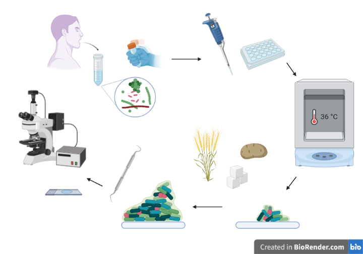

class: center, middle, inverse

```{r setup, include=FALSE}
knitr::opts_chunk$set(echo = FALSE, warning = FALSE, message = FALSE)
library(xaringanExtra)
library(kableExtra)
source("assets/scripts/pres-script.R")
```

```{r extras}
xaringanExtra::use_progress_bar(color = "#88ac82", location = "top")
```


# `r rmarkdown::metadata$title`

### `r rmarkdown::metadata$author`

#### `r params$event` | `r params$date`

#### [`r fontawesome::fa("link")` harvestproject.eu](https://www.harvestproject.eu)


---
class: bottom, right


`r fontawesome::fa("twitter")` [OsteoBjorn](https://twitter.com/osteobjorn)  
`r fontawesome::fa("github")` [bbartholdy](https://github.com/bbartholdy)
`r fontawesome::fa("link")` [bjorn.rbind.io](https://bjorn.rbind.io)

---
layout: true
<div class="footer"><a href="https://harvestproject.eu"><span>harvestproject.eu</span></a></div>
---
class: middle

## Dental calculus and diet

<!-- and, but, therefore -->

Dental calculus has become a widely used substance for multiple avenues of 
archaeological research

--

(quite successfully)

--

Including dietary research by extraction of plant microremains

However...

---
class: middle

.pull-left[
### What we know

- microremains preserve well in calculus
- they can be extracted from calculus to infer diet
]
.pull-right[
### What we don't know

- mechanism(s) of incorporation (and biases)
- methodological biases of extraction methods
- how diet affects calculus growth
- and a whole lot more...
]

---
class: middle, center, inverse

## So what are we going to do about it?

Presenting an oral biofilm model to grow and 'feed' dental calculus in a
highly controlled setting.

---
class: middle

## An oral what-now?

Biofilm: Communities of microbial cells within extracellular polymers.

Biofilm model: growing a biofilm in (or moving to) a lab for analysis.

--

Popular in clinical studies
- study the behaviour of microbiota in biofilms

- the affect of diet on dental disease, 

- and the effect of various treatments on (opportunistic) pathogens.

---
class: middle

## Calculus models

Also known as *in vitro* dental calculus

Common until the 90s, 

then focus shifted to short-term biofilm models for testing
treatments (caries, periodontitis, etc.)

Lack of interest from dental research since then

---

## Types of biofilm models

.pull-left[
**Simple**

- agar plate
- multiplate

**Complex**

- constant depth film fermenter
- modified robbins device
- artificial mouth
]
.pull-right[

```{r sissons-mam, out.width="60%", fig.align='center'}

```

.smaller[Multiple artificial mouth setup. Sissons et al. 1991.]
]
---
class: middle

## Our setup

.pull-left[

.smaller[Polypropylene 24 deepwell plate with "teeth" attached to lid.]
]

.pull-right[

- multiwell plate with suspended substrata
  - polypropylene 24 deepwell plate with lid
- substrata suspended vertically for active attachment
- high throughput model
- consistent treatment(s) across all samples
]

---
class: middle

## Protocol

.pull-left[
- inoculated with whole saliva
- incubated for 25 days (36&deg;C, 30 rpm)
- sucrose for bacterial growth
- wheat and potato treatments
- increase mineralisation with CPMU
- extraction (EDTA) and quantification of starches
]

.pull-right[
```{r byoc-protocol, fig.cap=""}

```
]

---
class: center, middle, inverse

## Goal

To test fundamental aspects of dental calculus analysis by using the oral biofilm model as a proxy.

---
class: center, middle, inverse

## Results

---

## End product

.center[It certainly looks like dental calculus.  
.red[**Red**] = model calculus, **black** = real calculus comparison.]

```{r ftir-fig, fig.cap="", fig.align='center', out.width="80%"}

```

---

## Extraction and quantification of starches

```{r sample-fig, out.width="50%", fig.align='center'}

```

.right[
.smaller[Microscope image of biofilm sample with potato starches and bacteria.  
Scale bar = 20 $\mu$m]
]
---
class: middle

.pull-left[

```{r solutions-bar-pl, out.width="95%"}
solutions_bar # not showing transparent background...
```

.smaller[Mean extrapolated counts for solutions]
]

.pull-right[

```{r sample-counts-boxplot, out.width="95%"}
counts_boxplot
```

.smaller[Mean extrapolated counts for granules extracted from the samples.]
]

---
class: middle

.pull-left[
```{r}
prop_bar
```
]

--

.pull-right[
Incorporation is so low it's not visible in the plot

so here's a table

```{r incorp-tbl-1}
knitr::kable(perc_tbl_out) %>%
  column_spec(6, background = "yellow")
```
.smaller[mean percentage of starches from solutions extracted from the calculus.]
]

---
class: middle

.pull-left[
```{r size-bias-pl-1, out.width="95%"}
ratio_plots_out
```
]

.pull-right[

<br>

Shift in size ratios from solution (outer ring) to sample (inner ring)

```{r incorp-tbl-2}
knitr::kable(perc_tbl_out) %>%
  column_spec(3:5, background = "yellow")
```
.smaller[Mean percentage of starches from solutions extracted from the calculus.]
]

---
class: middle

.pull-left[
```{r size-bias-pl-2, out.width="95%"}
ratio_plots_out
```
]

.pull-right[
### Size bias

Small (<10 $\mu$m) and medium (10-20 $\mu$m) starches over-represented

Large (>20 $\mu$m) starches under-represented
  - especially potato

]

---
class: middle

## What does this mean?

--

Replication is needed before confirming anything

--

But...

--

The low recovery rate of starch granules in fossil dental calculus likely starts *in vivo*

--

- further compounded by diagenesis

--

And the size of granules matters

--

- large-granule producers are under-represented

---
class: middle

## Starch incorporation

.pull-left[
```{r starch-incorp-fig, fig.cap="DISCLAIMER: this is an educated guess..."}

```
]

.pull-right[
`r emo::ji("left arrow")` Based on our results it may look something like this

But no one really seems to know <!--r emo::ji("shrug")`-->
]

---
class: middle

## Kinks in the model

--

No amylase (a beneficial side-effect?)

--

Deposits are not particularly large (ca. 1-10 $\mu$g)

--

Extrapolation of starch counts likely not 100% accurate

--

Starch delivery system is not perfect
- substrata are transferred to plate with starch solutions
- rpm is increased to double speed

---
class: middle

## Potential of the model

**Methods testing**
  
- extraction using various dissolution agents (e.g. EDTA and HCl)
- DNA and protein extraction and identification biases

--
  
**Training extraction and identification of starches (and other remains)**

- no need to use finite archaeological remains
- no ethical considerations

--

**High degree of control over multiple factors**

- dietary input
- bacterial composition (sort of...)

---
class: middle

## Summary

--

Interpretation of starches extracted from dental calculus is tricky

--

- very little is actually incorporated

--

- highly variable from sample to sample

--

- size affects likelihood of incorporation

--

We still know very little, but... 

--

our model can supplement archaeological studies

--

...and help us learn a little more

---
class: middle

## Open Science Statement

.left-column[
Open Data
Open Methods
Open Access

```{r open-repos, out.width="150px", fig.align='left'}

```
]

.right-column[
.center[
Slides available (with data and code):

<https://bbartholdy.github.io/capa2021-pres/CAPA-pres.html#1>

<https://osf.io/5fbxw/>

Protocols available: 

<https://www.protocols.io/workspaces/byoc>

Pre-print available:

<https://www.biorxiv.org/content/10.1101/2021.10.27.466104v1>
]
]

---
class: middle

## Acknowledgements

Dr. Shira Gur-Arieh

Dr. Stephanie Schnorr

### Funding

This research has received funding from the European Research Council under the European Union’s Horizon 2020 research and innovation program, grant agreement number STG–677576 (“HARVEST”). 

---

## References

.smaller[
Sissons, C. H., Cutress, T. W., Hoffman, M. P., & Wakefield, J. S. J. (1991). A Multi-station Dental Plaque Microcosm (Artificial Mouth) for the Study of Plaque Growth, Metabolism, pH, and Mineralization: Journal of Dental Research. https://doi.org/10.1177/00220345910700110301

Leonard, C., Vashro, L., O’Connell, J. F., & Henry, A. G. (2015). Plant microremains in dental calculus as a record of plant consumption: A test with Twe forager-horticulturalists. Journal of Archaeological Science: Reports, 2, 449–457. https://doi.org/10.1016/j.jasrep.2015.03.009

Power, R. C., Salazar-García, D. C., Wittig, R. M., & Henry, A. G. (2014). Assessing use and suitability of scanning electron microscopy in the analysis of micro remains in dental calculus. Journal of Archaeological Science, 49, 160–169. https://doi.org/10.1016/j.jas.2014.04.016
]